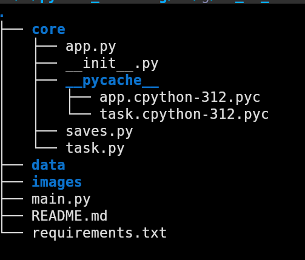

# School GUI Project
This is a school project created for studying **`GUI development`** and **`application architecture`** in Python.

The graphical interface is built using **`CustomTkinter`**:
https://customtkinter.tomschimansky.com/

## Project Structure

## How to Run the Project
1. Install all required libraries from requirements.txt:
**`pip install -r requirements.txt`**

2. Run the main file:
**`python3 main.py`**

# Notes
- The project does not save data yet — the save functionality has not been implemented.
